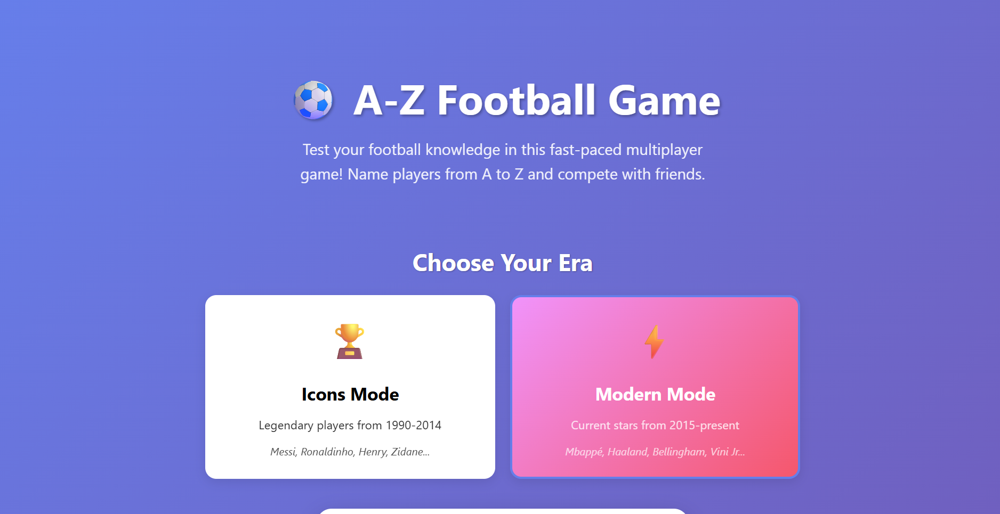
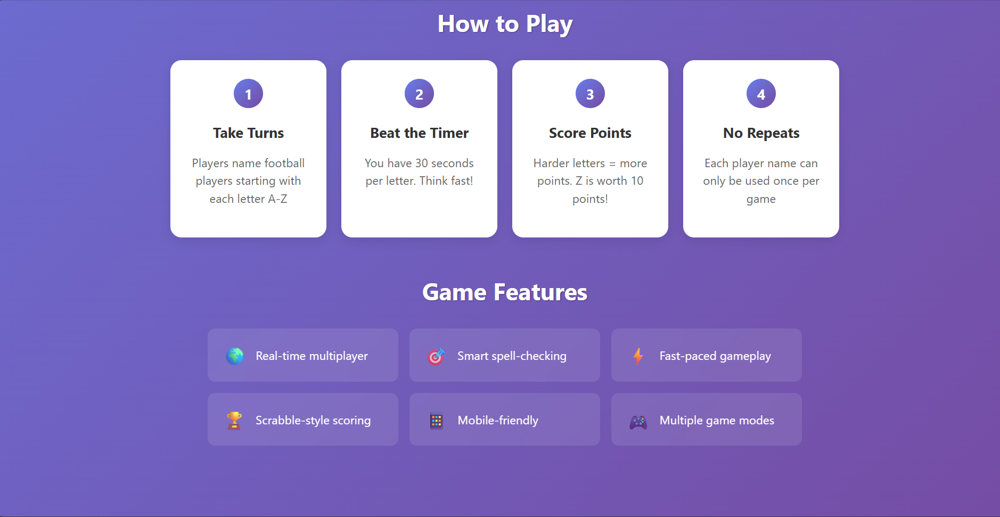
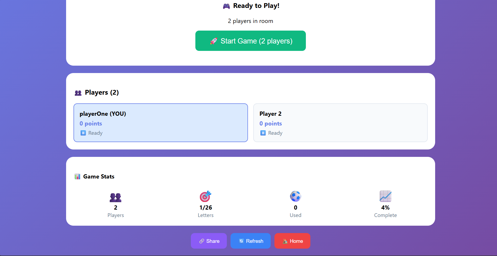

# A-Z Trivia Challenge

A real-time multiplayer A-Z trivia game. Name famous people from A to Z — beat the clock, outscore your mates. Six categories, one letter at a time.

<div style="display: flex; flex-wrap: wrap; justify-content: center; gap: 1rem; margin: 2rem 0;">
  <a href="assets/Screenshot1.png"></a>
  <a href="assets/Screenshot2.png"></a>
  <a href="assets/Screenshot3.png"></a>
</div>

---

## Game Categories

| Category | Modes | Database size |
|----------|-------|---------------|
| ⚽ Football | Icons (retired legends, pre-2015) · Modern (2015–present) | ~1,200 players |
| 🏀 NBA | Legends (pre-2015) · Modern (2015–present) | ~900 players |
| 🤼 WWE | All Eras · Golden · Attitude · Ruthless Aggression · PG Era · Modern | ~175 superstars |
| 🎵 Music | 9 genres (Hip-Hop, Pop, Rock, R&B, EDM, Latin, Country, K-Pop, Afrobeats) × Classic/Modern | ~540 artists |
| 🏎️ F1 | Legends (pre-2015) · Modern (2015–present) | ~324 drivers |
| 🎬 Movies | Classic (pre-1990) · Modern (1990–now) | ~80 actors |

---

## Features

### Gameplay
- **Real-time multiplayer** via Socket.io — share a room code, play instantly
- **26 rounds**, one per letter of the alphabet (A → Z)
- **30-second timer** per letter — buzzer ends the round
- **No repeats** — each name can only be used once across all players
- **Pause & resume** — any player can pause mid-round; the game saves its exact state and can be resumed any time (even days later)

### Smart Answer Validation
- **600+ nickname aliases** — CR7, Dinho, The Rock, The Undertaker, MJ, etc. all accepted
- **Fuse.js fuzzy matching** — minor typos and accent-less spellings accepted
- **Multi-word partial matching** — typing just a surname or first name can match
- **Partial scoring** — very close but not exact spellings (e.g. "Viktor Osimen" for "Victor Osimhen") earn **half points** shown as ⚡ instead of ✅
- **Stylised name normalisation** — `Ke$ha` and `Kesha`, `P!nk` and `Pink` both match
- **Levenshtein guard** prevents false positives (won't match unrelated short words)

### Scoring
Scrabble-style letter values — rare letters score more:

| Points | Letters |
|--------|---------|
| 10 | Q, Z |
| 8 | X |
| 8 | J |
| 4–5 | K, V, W, H, F, Y |
| 2–3 | B, C, D, G, M, P |
| 1 | A, E, I, L, N, O, R, S, T, U |

Near-miss answers (fuzzy match) earn **½ the letter value**, rounded down.

### Did You Know (DYK) Facts
- Shows a random fact popup **once per day per category** on first game entry
- Each category has its own curated fact pool (Football, NBA, WWE, Music, F1, Movies)
- Non-repeating rotation — cycles through all facts before repeating
- 100% offline — no API, no quota, hardcoded facts

### Coming Soon (Firebase required)
- **Unique usernames** — 3–20 chars, letters/numbers/underscores/hyphens, case-insensitive uniqueness enforced via Firestore
- **Username change limit** — once every 30 days
- **Leaderboard** — all-time points and wins, filterable by category
- **Friends** — send friend requests by username, see friends' scores
- **Game history** — persistent record of past games
- **Google Sign-In** — one-click auth, profile photo used as avatar

---

## Tech Stack

| Layer | Tech |
|-------|------|
| Frontend | Next.js 15 · React 19 |
| Real-time | Socket.io 4.8.1 (custom Node.js server) |
| Fuzzy matching | Fuse.js 7.1.0 + custom Levenshtein |
| Player data | Local JSON files (no DB needed for gameplay) |
| Styling | CSS-in-JSX (dark glassmorphism theme) |
| Auth/Social | Firebase (Firestore + Auth) — pending setup |
| Hosting | Koyeb (backend) · Vercel (frontend) |

---

## Environment Variables

Set these on Koyeb (backend) — no `.env` file needed for the game itself. Required only when Firebase is connected:

```
NEXT_PUBLIC_FIREBASE_API_KEY
NEXT_PUBLIC_FIREBASE_AUTH_DOMAIN
NEXT_PUBLIC_FIREBASE_PROJECT_ID
NEXT_PUBLIC_FIREBASE_STORAGE_BUCKET
NEXT_PUBLIC_FIREBASE_MESSAGING_SENDER_ID
NEXT_PUBLIC_FIREBASE_APP_ID
```

---

## Firebase Setup

See `FIREBASE_GEMINI_PROMPT.md` for the complete Gemini prompt that generates all Firebase config.

Files already in the repo:
- `firestore.rules` — security rules (username uniqueness, 30-day change lock, friend privacy)
- `firestore.indexes.json` — composite indexes for leaderboard, friends, game history
- `functions/index.js` — Cloud Functions: `onUserCreated`, `updateLeaderboard`, `cleanupUsername`
- `firebase.json` — CLI config
- `.firebaserc` — fill in your Firebase project ID, then run `firebase deploy --only firestore,functions`

---

## Running Locally

```bash
npm install
npm run dev          # starts Next.js + Socket.io server together
```

Open `http://localhost:3000`. Create a room, share the room code with a mate (or open a second tab).

---

## Project Structure

```
├── components/
│   └── GameBoard.js        # Main game UI + validation + Socket.io client
├── data/
│   └── players/
│       ├── refined-database.json   # Football (icons + modern)
│       ├── nba.json                # NBA (legends + modern, 30 teams)
│       ├── wwe.json                # WWE (5 eras)
│       ├── music.json              # Music (9 genres × classic/modern)
│       ├── f1.json                 # F1 (11 teams × legends/modern)
│       └── movies.json             # Movies (classic/modern)
├── lib/
│   └── fuzzyMatch.js       # Levenshtein + wordFuzzyMatch helpers
├── pages/
│   ├── index.js            # Home screen (category + mode selector)
│   ├── game/[roomId].js    # Game room page
│   ├── leaderboard.js      # Leaderboard (Firebase pending)
│   ├── friends.js          # Friends (Firebase pending)
│   └── api/players/[mode].js  # REST endpoint — serves player lists by mode
├── server.js               # Socket.io game server
├── firestore.rules
├── firestore.indexes.json
└── functions/index.js      # Cloud Functions
```
